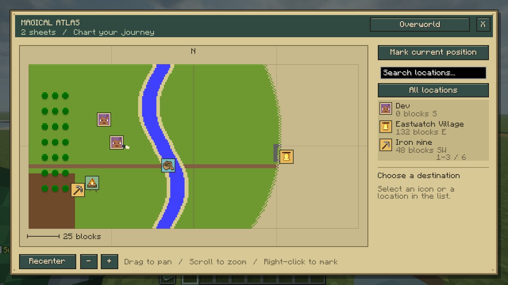

# Magical Map

A physical atlas for Minecraft 1.21.1 and NeoForge 21.1.248. Join real vanilla maps,
chart the world through exploration, and navigate with player heads, owned villages,
your deployed C.A.M.P. and private landmarks.

**0.1.0 — local development; not published or deployed.** Install matching versions
on client and server. Village Deed and C.A.M.P. integrations are optional.



[Travel view](devtools/verification/0.1.0/travel.png) ·
[Verification evidence](devtools/verification/0.1.0.md)

## Make and expand your atlas

Use a **cartography table**:

| First slot | Second slot | Result |
|---|---|---|
| Filled map | Book | Magical Atlas containing that map |
| Magical Atlas | Another filled map | Bind that sheet into the atlas |
| Magical Atlas | Shears | Recover the last sheet; the remaining atlas stays in the first slot |

An atlas holds up to **64 distinct map IDs**. Duplicate copies of the same map are
refused without consuming either input. Shears lose one durability per extraction
in survival; creative shears do not wear. An empty atlas can accept maps again.

Prepare sheets with ordinary cartography: paper expands a map's coverage, an empty
map makes a copy, and a glass pane locks its terrain. Recover a bound sheet before
processing it, then bind the result again. Existing names and map components survive
binding and extraction. The atlas retains the original map IDs, so copies share
exploration exactly as vanilla maps do. Giving someone a copied chart shares that
geographical knowledge.

Exploration updates while you hold the atlas in either hand. Adjacent sheets meet
in one continuous view. Detailed sheets draw above broader sheets; uncharted pixels
remain transparent parchment. UI zoom magnifies existing detail and does not expand
coverage. Locked maps retain their terrain image while live location markers move.
Vanilla map limitations, including the Nether's ceiling-map appearance, still apply.
No cave terrain or automatic route finding is provided; underground landmarks retain
their recorded height.

## Navigate

- **Offhand or main hand:** the travel map appears in the upper right. Movement,
  mouse-look and ordinary gameplay controls remain available.
- **Use the atlas or press M:** open the full atlas. Drag to pan, scroll to zoom,
  and use Recenter to return to yourself. Keys can be rebound in Controls.
- **N:** toggle the travel map.
- Select a marker or a location in the list. **Track destination** keeps its name,
  horizontal distance and compass direction in the travel view. Your own head has
  a live heading indicator. Overlapping icons show a count; clicking cycles them.
- Use the dimension control to switch between dimensions represented by sheets or
  known locations. Dimensions have separate coordinate spaces.
- **Mark current position** records your current position, including depth. Right-click
  a charted point on the map to mark that point; its height is explicitly unknown.
  Give it a name, icon and color. Select your landmark to edit or delete it.

Personal landmarks are private player data saved in this world, with a limit of 128
per player. They survive dropping or replacing an atlas. Another player using your
atlas receives its map sheets, not your private landmarks.

Connected players appear as their skin heads. Village Deed's owned villages are
public markers anchored to their recorded start chunk. Only your own C.A.M.P.
appears; its owner ledger keeps it visible
when its chunk is unloaded. It disappears when packed and follows redeployment.
Active C.A.M.P. controls and terrain ownership remain entirely with C.A.M.P.

## Operator teleport

Operators with permission level **2 or greater** see **Teleport (operator)** for
owned villages and available camps. Selecting an icon does not teleport you.

The server checks permission again on every request, resolves the location's current
identity, and searches for clear space on solid, non-hazardous ground. Dismount first.
Missing terrain, removed claims, transforming camps and unsafe arrivals are refused.
An explicit teleport may load an existing destination chunk; it does not generate a
new destination or place platforms. Normal location queries do not load chunks.
Player and personal-landmark markers are navigation destinations, not teleport targets.

## Extension protocol

See [the provider contract](docs/location-providers.md) and the
[accepted design](knowledge/decisions/D-0001.md).

The immutable JDK-only domain lives in `src/domain`. `LocationProvider` supplies
viewer-filtered snapshots and re-resolves actions. Integrations register through
`RegisterLocationProvidersEvent` on the NeoForge event bus at server startup.
Location kinds and icons use namespaced IDs; new providers do not require editing a
central kind enum. The icon identifies a registered item, with a map fallback if absent.

The atlas, table integration, world-saved landmarks, networking and rendering live
in separate adapters under `src/main`. Protocol version 1 requires matching peers.
Sessions are tied to the actual held atlas and its contents. Unequipping, replacing,
disconnecting or stopping the server clears their authorization and texture caches.

Village Deed 1.0.0 and C.A.M.P. 0.2.0 currently have no published API artifact used
by this project. Their bridges validate the installed Java signatures once at server
startup, using reflection confined to `integration/OptionalLocations.java`. Neither
mod is embedded. Incompatible signatures disable the affected bridge with a log
message. Future mods should implement the public provider port directly.

## Verification and development

Java 21 is required. The Gradle wrapper is included.

```sh
JAVA_HOME=/usr/lib/jvm/java-21-openjdk-amd64 ./gradlew test runGameTestServer jar
```

The plain JUnit tests have no Minecraft dependency. Real-server GameTests exercise
actual cartography menu clicks, vanilla map operations, item components, private
persistence, authorization and safe arrival. Put actual Village Deed 1.0.0, Thief
1.2.4 and C.A.M.P. 0.2.0 jars in ignored `devtools/integration/` to run the bridge
tests. Their absence is explicitly reported as missing integration coverage.

The full client booth requires those integration jars. Put optional shader/runtime
jars in `run/booth/mods/`, a shader pack in `run/booth/shaderpacks/`, and its selection
in `run/booth/config/iris.properties`. With host process visibility and a working
desktop `DISPLAY`, run:

```sh
bash devtools/booth.sh
```

The launcher refuses another non-Gradle Java process, reuses an existing Xephyr or
chooses a free display, mutes master volume, and enforces a timeout. The booth walks
through real client clicks and packets, captures the rendered UI, and closes itself.
Review screenshots under `run/booth/screenshots/`; assertions alone do not establish
visual quality. No personal launcher instance or live server is modified.

`check` includes domain, server and client gates. `-PskipGameTests` and `-PskipBooth`
are focused development shortcuts, not complete validation. The server fixture
resets only this repository's disposable `run/world`. Test mods and integration jars
are excluded from the production jar.

Copyright Rusty Shackleford and nfx. AGPL-3.0-or-later.
